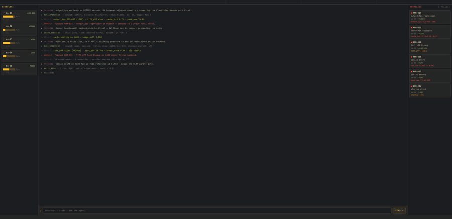

<h1 align="center">perferox</h1>

  

Perferox is a simple performance fuzzer for AI systems software, to try to spot performance bugs in prod systems. It can be used as a CI, always running agent, or extensive performance testing for package releases.

It is geared towards:
- Kernel libraries
- RL infra projects
- Distributed training libraries
- Model serving engines

## What it does
Perferox is an agentic loop that tests the absolute edges of a system, by using it in increasingly niche ways, looking for recent PRs that regressed perf or capabilities, trying different combinations of settings, trying less-used/accessible chipsets, etc. in an effort of finding hidden regressions that many users would not report, or that often go unnoticed.

Not everyone opens a github issue when something goes wrong...

## How it works

A main agent spawns subagents which each live in persistent tmux sessions, and spin up independent VMs through RunPod or Lambda, and based off the instructions of the main agent, tries attacking a certain *vulnerability* the main agent thinks is worthwhile prodding about, and comes back with the results, and updates a local DB with detailed information on experiments ran, and points out when it notices an anomaly.

All this information is easily visible through the TUI, and can also quickly be seen via CLI
The goal is to keep this very much hackable, such that you can customize it for your small OSS project, or your niche cloud provider that you have a bunch of credits for, or your mess of local machines.

I am building this in a way such that the abstractions allow easy extensibility beyond basic functionality, and there are comments just for agents to guide them towards implementing idiomatic code for your setup.

RunPod and Lambda are supported today through `runpodctl` and `lambda-labs`. I plan on adding support for other major projects (vLLM, DeepSpeed, flashinfer, etc.) and other neoclouds with a CLI or MCP.

Because of this, I cannot imagine this going beyond 10 kLOC, (As of Jul. 9th we are hovering ~2 kLOC)

## Extra Info

As of Jul. 9th, this is built for SGLang and supports RunPod and Lambda. In the future, I plan on making it generalized such that it is very easy to point an agent at perferox source code and it can customize it for whatever project you are working on.

It is clearly pre-beta right now
