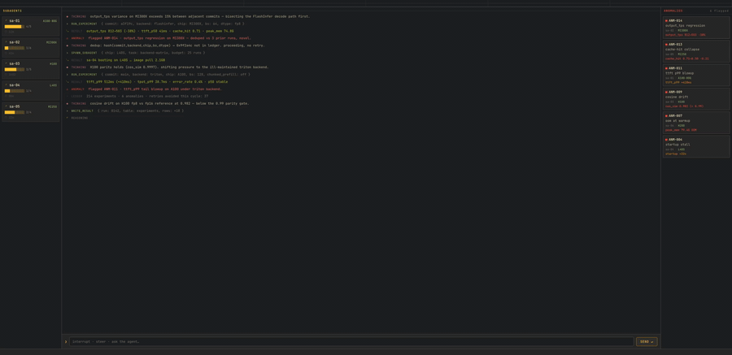

<h1 align="center">perferox</h1>

<p align="center">
  <a href="perferox/perferox-tui-demo.mp4">
    
  </a>
</p>


Perferox is a simple performance fuzzer for AI systems software, to try to spot performance bugs in prod systems. It can be used as a CI, always running agent, or extensive performance testing for package releases.

It is geared towards:
- Kernel libraries
- RL infra projects
- Distributed training libraries
- Model serving engines

## What it does
Perferox is an agentic loop that tests the absolute edges of a system, by using it in increasingly niche ways, looking for recent PRs that regressed perf or capabilities, trying different combinations of settings, trying less-used/accessible chipsets, etc. in an effort of finding hidden regressions that many users would not report, or that often go unnoticed.

Not everyone opens a github issue when something goes wrong...

## Getting started

```bash
uv sync
uv run perferox onboard
uv run perferox run "look for a regression in the radix cache"
```

`perferox onboard` asks two questions: which model does the thinking, and which cloud rents the GPU. It saves the answer to `~/.perferox/config.json`, so the TUI, the CLI, and the detached tmux workers all agree on it. Run it again any time to change your mind, or use `perferox providers` to see what is configured.

## Model providers

Perferox drives one chat model. You can sign in with an account, bring an API key, or point it at a server on your own machine.

| How you authenticate | Providers |
| --- | --- |
| Account sign-in, no API key | ChatGPT, xAI (Grok) |
| API key | OpenAI, Anthropic, xAI, OpenRouter, Cloudflare Workers AI, Gemini, DeepSeek, Groq, Mistral, Moonshot, Z.AI, MiniMax, Together, Fireworks, Cerebras |
| Local | Ollama, llama.cpp |

Both sign-ins are OAuth with PKCE and refresh in the background, so a run that lasts hours does not die on an expired token. `perferox login chatgpt` and `perferox login grok` open a browser; over SSH they fall back to a flow you can finish on another machine. API keys are read from their usual environment variables (`OPENAI_API_KEY`, `ANTHROPIC_API_KEY`, and so on), or pasted during onboarding and stored in `~/.perferox/credentials.json` with mode 0600.

Everything except ChatGPT speaks the OpenAI chat-completions dialect, so a provider is one row in `perferox/providers.py`. Add a row and it shows up in onboarding, in `perferox providers`, and in the TUI without touching anything else.

## How it works

A main agent spawns benchmark subagents in persistent tmux sessions. Each subagent creates an isolated GPU environment through RunPod, Lambda, or Modal, investigates one focused hypothesis from the main agent, records its experiments in SQLite, and reports anomalies.

All this information is easily visible through the TUI, and can also quickly be seen via CLI
The goal is to keep this very much hackable, such that you can customize it for your small OSS project, or your niche cloud provider that you have a bunch of credits for, or your mess of local machines.

I am building this in a way such that the abstractions allow easy extensibility beyond basic functionality, and there are comments just for agents to guide them towards implementing idiomatic code for your setup.

RunPod and Lambda use `runpodctl` and `lambda-labs`; Modal uses its native Sandbox API and command execution instead of SSH. All three backends share the same host-owned lifecycle: one tracked resource per subagent, persisted resource IDs, bounded benchmark runs, soft-stop handling, and automatic teardown. Authenticate Modal once with `modal setup`, or set both `MODAL_TOKEN_ID` and `MODAL_TOKEN_SECRET`.

I plan on adding support for other major projects (vLLM, DeepSpeed, flashinfer, etc.) and other neoclouds with a CLI or MCP.


Because of this, I cannot imagine this going beyond 10 kLOC, (As of Jul. 9th we are hovering ~2 kLOC)


## Extra Info

This is built for SGLang and supports RunPod, Lambda, and Modal. In the future, I plan on making it generalized such that it is very easy to point an agent at perferox source code and it can customize it for whatever project you are working on.

It is clearly pre-beta right now
