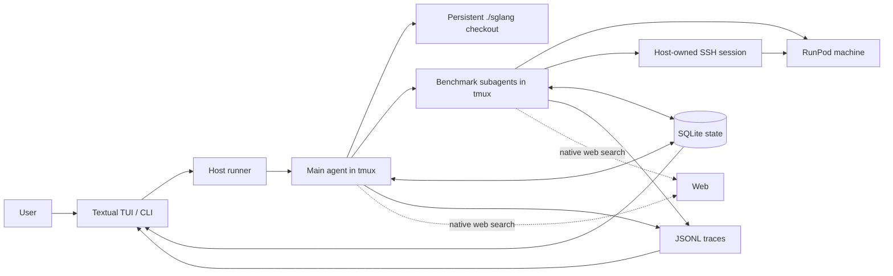
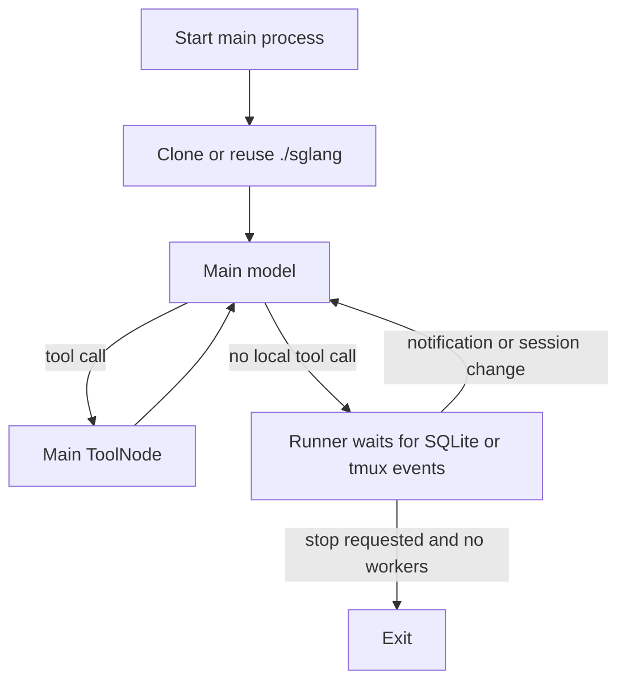
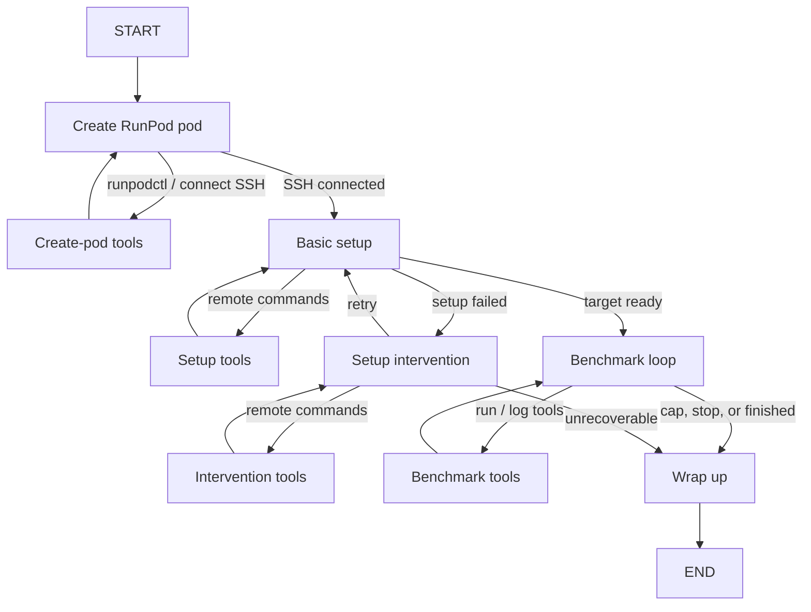
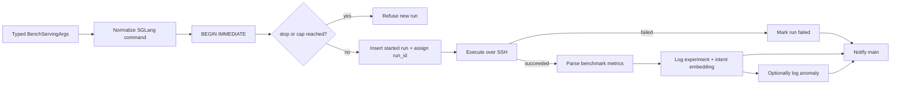
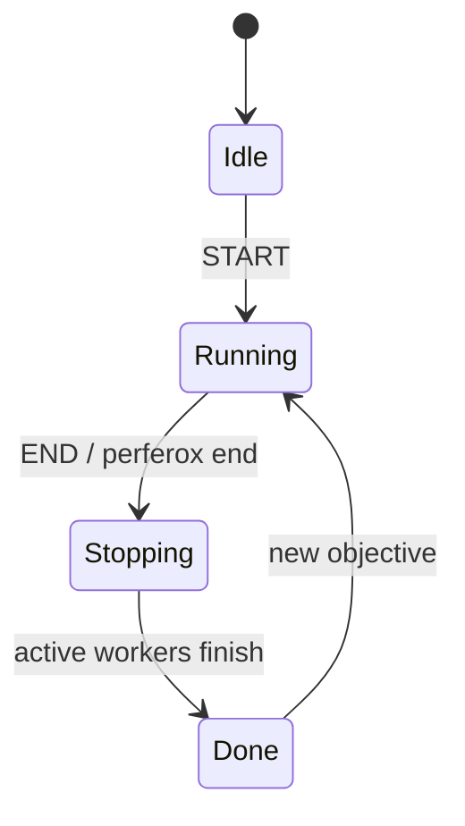

# Perferox structures

This document describes the structure implemented on `master`. It is an operational map: what runs where, which layer owns each fact, and how work moves through the system.

Perferox is intentionally small. Models choose what to investigate and how to set up a target; the host owns identities, limits, persistence, and process lifecycle.

## System map

The important split is:

| Model-owned | Host-owned |
| --- | --- |
| hypotheses and exploration direction | agent and run IDs |
| repository setup strategy | attempt caps and stop state |
| benchmark parameters | SQLite writes and transactions |
| whether behavior looks interesting | tmux sessions, trace paths, and SSH objects |
| concise summaries | tool schemas and command execution |

Agents receive goals and immutable constraints, then choose the simplest useful path inside those bounds.

## Entry points and processes

`perferox` exposes four user paths:

- no command opens the Textual dashboard;
- `perferox run <objective>` launches the main agent;
- `perferox status` prints persisted state;
- `perferox end` requests a soft stop.

The TUI and CLI both launch `perferox.agent_runner`. The runner creates persistent tmux processes so the UI can exit or reconnect without owning the agent loop.

The main process uses two roots:

- **runtime root** — the Perferox checkout containing SQLite, traces, `uv`, and worker launch code;
- **source root** — a persistent full SGLang clone at `<runtime root>/sglang` used by the main agent's code-reading tools.

The SGLang checkout is cloned only when `sglang/.git` is absent. Existing edits, commits, and branches are preserved.

## Main coordinator

The main graph has one model node and one local tool node. The outer runner keeps the longer-lived process alive between graph invocations.

Before each model call, the coordinator receives:

- the user objective;
- compact ExplorerState lines;
- recent tmux session rows;
- accumulated LangGraph messages.

Its tools are:

- `bash`, `read_file`, and `search_files` against the SGLang source root;
- read-only SQLite queries;
- semantic lookup over SGLang `doc_chunks`;
- semantic lookup over prior experiment intents;
- read/write access to compact ExplorerState;
- `delegate_benchmark_subagent`;
- native server-side web search.

Delegation takes exactly four model-supplied values: `repository`, `commit`, `goal`, and `attempt_cap`. The host validates them, assigns the next `agent_id`, creates trace/goal files, and starts `perferox-agent-<id>` in tmux. At most three subagents may be active.

## Benchmark worker

Each subagent receives one exact repository, commit, goal, and hard attempt cap. The graph changes its local tools by phase while web search remains available during active model phases.

The normal setup path is:

1. choose a RunPod environment;
2. optionally use a container when it clearly reduces setup work;
3. clone the delegated repository into `/workspace/target`;
4. check out the exact commit in detached HEAD state;
5. verify it with `git rev-parse HEAD`;
6. follow the repository's own build instructions.

The container is a suggestion, not a requirement. For SGLang, the prompt points workers to `lmsysorg/sglang` image tags as a useful starting point.

Worker tools are deliberately phase-scoped:

| Phase | Mutating capabilities |
| --- | --- |
| create pod | local `runpodctl`, connect host SSH session |
| setup / intervention | remote shell over the registered SSH session |
| benchmark | remote shell, structured SGLang benchmark, log experiment, log anomaly |
| wrap-up | write one summary notification to SQLite |

The worker stores only messages, `agent_id`, and its final summary in LangGraph state. Live SSH clients stay in a host `SessionRegistry`, never in graph state or traces.

## One benchmark attempt

Real experiments go through `sglang_bench_serving`; raw remote commands are for setup and inspection.

Started failures count against the cap. Invalid arguments do not, because no run row is created. SQLite serializes run-number assignment and enforces the cap in the same transaction.

## Durable state

SQLite is the source of truth; prompts and message history are not bookkeeping systems.

| Table | Purpose |
| --- | --- |
| `runs` | every started benchmark, command hash, timing, trace, and failure state |
| `experiments` | successful normalized metrics plus human-readable intent and embedding |
| `anomalies` | human-readable surprising behavior tied to a run |
| `agent_sessions` | main/subagent tmux identity and lifecycle status |
| `main_notifications` | durable wakeups for run, experiment, anomaly, and summary events |
| `explorer_state_lines` | compact append-only exploration memory |
| `doc_chunks` | locally ingested SGLang reference text and embeddings |

`(agent_id, run_id)` is the run identity. `run_id` starts at zero for each agent. The command `exact_hash` is unique, preventing the same normalized benchmark command from being started twice.

JSONL complements SQLite rather than replacing it. Each graph update is appended to a main or worker trace for replay and debugging; the TUI combines trace tails with SQLite events.

## Soft stop

The End action changes running `agent_sessions` rows to `ending`. After that:

- the main agent refuses new delegation;
- `start_benchmark_run` refuses new attempts;
- workers observe the stop flag and route to wrap-up;
- an already-running remote benchmark is allowed to finish;
- the main process exits after no worker sessions remain.

The host does not rely on a model voluntarily honoring the stop request.

## Module boundaries

| Module | Responsibility |
| --- | --- |
| `cli.py` | CLI routing for TUI, run, status, and end |
| `tui.py` | OAuth gate, live dashboard, launch, and soft-stop controls |
| `agent_runner.py` | tmux process entry points, persistent SGLang workspace, traces, and wakeups |
| `main_agent.py` | coordinator graph, research tools, ExplorerState, and delegation |
| `subagent.py` | fixed worker lifecycle graph and final summary notification |
| `tools.py` | local/remote execution and narrow host-owned LangChain tools |
| `bench.py` | typed SGLang serving arguments, command generation, and metric parsing |
| `db.py` / `init-db.sql` | transactions, IDs, caps, persistence, embeddings, and notifications |
| `remote.py` | Paramiko SSH session and in-process session registry |
| `auth.py` | persisted ChatGPT OAuth and Codex chat model construction |
| `prompts.py` | RunPod reference and phase-specific worker constraints |

## Current boundaries

These are current implementation limits, not hidden abstractions:

- the main agent's local source checkout is always SGLang;
- workers can set up an arbitrary repository commit, but the structured benchmark tool still runs `sglang.benchmark.serving`;
- RunPod is the only implemented cloud lifecycle;
- web search is available, but there is no structured GitHub issue/PR/code connector yet;
- exact remote checkout verification is instructed and reported by the worker, not independently attested by the host;
- the host closes SSH sessions, but pod IDs are not yet kept in a host-owned pod registry;
- anomaly analysis is inline logging only; there is no separate periodic anomaly agent;
- there is no implemented global runtime deadline.

New providers and targets should extend the narrow provider and benchmark seams without weakening SQLite ownership of IDs, caps, stop state, or durable results.
